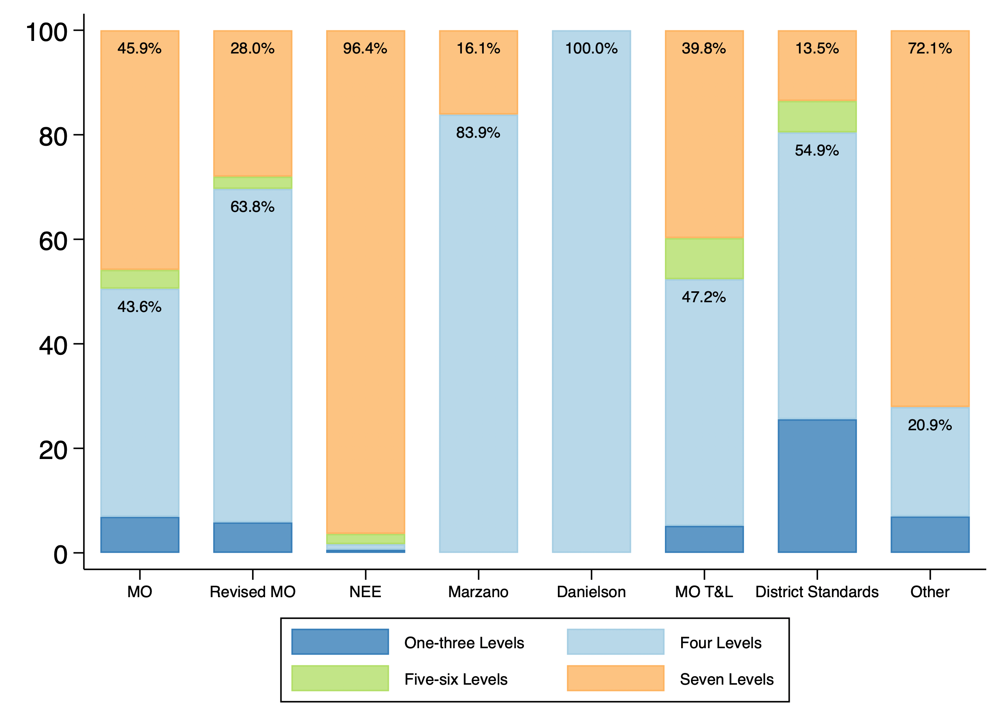

**ERRE Report · May 2026**
**Authors:** Tuan D. Nguyen, Yujia Liu, & Cory Koedel
**Educator Recruitment, Retention, and Effectiveness (ERRE) Center, University of Missouri**

This report presents a landscape analysis of teacher evaluation models used across Missouri school districts during the post-COVID period from the 2022–23 through 2024–25 school years. It offers a descriptive overview of the evaluation models, examines their geographic distribution, and explores variation across districts operating in different contexts. The analysis draws primarily on the annual Educator Evaluation Survey administered by the Missouri Department of Elementary and Secondary Education.

## Key Findings

- Seven different teacher evaluation models are in use in Missouri districts, but four models account for nearly all adoptions.
- The NEE model is the most widely used model, especially in small and rural districts.
- City and suburban districts draw on a more diverse mix of evaluation models.
- Most evaluation models divide teachers into four or seven performance rating categories.
- Teachers are rated "effective" at consistently high levels under every model.
- Suburban districts report the highest average share of teachers rated effective; city districts report the lowest.

## Performance Rating Levels

Most evaluation models use either four or seven rating categories. The NEE model employs a scale with seven categories (about 96 percent). At the opposite extreme, the Danielson model uses a four-level scale across all adopting schools. The Marzano model, the Revised MO model, and district-developed standards also lean heavily toward four levels, with roughly two-thirds to four-fifths of their schools adopting that structure. The MO model and the MO T&L model split almost evenly between four and seven levels.

*Figure 2.1. Distribution of Performance Rating Levels by Teacher Evaluation Model (2024–25)*

## Download

**[⬇ Download Full Report (PDF)](ERRE-TEL-MO-Report.pdf)**

**[⬇ Download Research Brief (PDF)](ERRE-TEL-MO-Brief.pdf)** — a shorter summary of this report's findings.
